# Diagramas del Sistema de Subastas - Desguaces Borox

## 1. Diagrama Entidad-Relación (Base de Datos)


## 2. Diagrama de Arquitectura del Sistema


## 3. Diagrama de Flujo: Registro y Validación de Usuario


## 4. Diagrama de Flujo: Creación de Subasta y Puja


## 5. Diagrama de Flujo: Sistema de Notificaciones Admin

```mermaid
flowchart LR
    subgraph "Eventos que generan notificaciones"
        E1[Usuario se registra]
        E2[Usuario sube IAE]
    end
    
    subgraph "Backend con Manejo de Errores"
        C1[UsuariosController.Registro]
        C2[DocumentosController.SubirIAE]
        DB[(NotificacionAdmin Table)]
        TRY{Tabla existe?}
        CATCH[Logger.LogError<br/>Return empty array/0]
    end
    
    subgraph "Frontend Admin - Defensivo"
        P[Polling cada 30s]
        N[Componente Notificaciones]
        L[Lista de notificaciones]
        B[Badge contador no leídas]
        EMPTY[Estado vacío]
    end
    
    E1 --> C1
    E2 --> C2
    C1 --> DB
    C2 --> DB
    
    P --> API[GET /api/NotificacionesAdmin]
    API --> TRY
    TRY -->|Sí| DB
    TRY -->|No| CATCH
    DB --> N
    CATCH --> N
    N -->|Datos vacíos| EMPTY
    N -->|Datos válidos| L
    N --> B
    
    L --> M[Marcar como leída]
    M --> API2[PUT /api/NotificacionesAdmin/{id}/leer]
    API2 --> DB
    
    style E1 fill:#FFE4B5
    style E2 fill:#FFE4B5
    style DB fill:#FFA07A
    style B fill:#98FB98
    style CATCH fill:#FF6B6B
    style EMPTY fill:#E8E8E8
```

## 6. Diagrama de Casos de Uso

```mermaid
graph TB
    subgraph "Usuario No Registrado"
        U1((Usuario<br/>Visitante))
        UC1[Registrarse]
        UC2[Ver subastas públicas]
        
        U1 --> UC1
        U1 --> UC2
    end
    
    subgraph "Usuario Registrado No Validado"
        U2((Usuario<br/>Registrado))
        UC3[Subir documento IAE]
        UC4[Ver perfil]
        UC5[Editar perfil]
        
        U2 --> UC3
        U2 --> UC4
        U2 --> UC5
    end
    
    subgraph "Usuario Validado"
        U3((Usuario<br/>Validado))
        UC6[Realizar pujas]
        UC7[Ver mis pujas]
        UC8[Ver historial]
        
        U3 --> UC6
        U3 --> UC7
        U3 --> UC8
    end
    
    subgraph "Empresa"
        U4((Empresa))
        UC9[Registrar vehículos]
        UC10[Crear subastas]
        UC11[Gestionar vehículos]
        
        U4 --> UC9
        U4 --> UC10
        U4 --> UC11
    end
    
    subgraph "Administrador"
        U5((Admin))
        UC12[Validar usuarios]
        UC13[Gestionar usuarios]
        UC14[Ver notificaciones]
        UC15[Descargar documentos IAE]
        UC16[Gestionar pujas]
        UC17[Gestionar empresas]
        
        U5 --> UC12
        U5 --> UC13
        U5 --> UC14
        U5 --> UC15
        U5 --> UC16
        U5 --> UC17
    end
    
    style U1 fill:#E8F4F8
    style U2 fill:#FFF4E6
    style U3 fill:#E8F5E9
    style U4 fill:#F3E5F5
    style U5 fill:#FFEBEE
```



## 7. Diagrama de Estados de Usuario


## 8. Diagrama de Estados de Subasta


## 9. Diagrama de Seguridad y Autenticación

```mermaid
sequenceDiagram
    participant U as Usuario
    participant F as Frontend
    participant Guard as authGuard/adminGuard
    participant API as Backend API
    participant JWT as JWT Service
    participant DB as Database
    
    U->>F: POST /login (email, password)
    F->>API: Credenciales
    API->>DB: SELECT Usuario WHERE email
    DB->>API: Usuario encontrado
    API->>API: BCrypt.Verify(password, hash)
    API->>JWT: Generar token (2h expiración)
    JWT->>API: Token JWT
    API->>F: {token, usuario}
    F->>F: localStorage.setItem('token')
    F->>F: authService.currentUser.set(usuario)
    
    alt Rol es Admin
        F->>F: router.navigate(['/admin/dashboard'])
    else Rol es Usuario
        F->>F: router.navigate(['/dashboard'])
    end
    
    Note over U,DB: Usuario intenta acceder a ruta protegida
    
    F->>Guard: canActivate()
    Guard->>F: authService.currentUser()
    F->>Guard: Usuario actual
    
    alt Es ruta admin
        Guard->>Guard: Verificar rol === 'admin' || 'administrador'
        Guard->>F: Permitir/Denegar acceso
    else Es ruta normal
        Guard->>Guard: Verificar validado === 1
        Guard->>F: Permitir/Denegar acceso
    end
    
    alt Token expirado (>2h)
        F->>U: Redirigir a /login
    end
```



## 10. Diagrama de Componentes Frontend

```mermaid
graph TB
    subgraph "App Root"
        APP[app.ts]
        ROUTES[app.routes.ts]
    end
    
    subgraph "Layout"
        LAYOUT[layout.component]
        NAV[Navegación dinámica]
        TOAST[ToastService]
    end
    
    subgraph "Public Routes"
        LOGIN[login.component]
        REGISTER[register.component]
        HOME[home.component]
    end
    
    subgraph "User Routes canActivate: authGuard"
        PERFIL[perfil.component]
        SUBASTAS[subastas.component]
        SUBIR_IAE[subir-iae.component]
    end
    
    subgraph "Admin Routes canActivate: adminGuard"
        USUARIOS[usuarios.component]
        NOTIF[notificaciones-admin.component]
        PUJAS[pujas-admin.component]
        EMPRESAS[empresas-admin.component]
    end
    
    subgraph "Services"
        AUTH[AuthService]
        NOTIF_SVC[NotificationService]
        HTTP[HttpClient]
    end
    
    APP --> ROUTES
    ROUTES --> LAYOUT
    LAYOUT --> NAV
    LAYOUT --> PUBLIC
    
    ROUTES --> LOGIN
    ROUTES --> REGISTER
    ROUTES --> HOME
    
    ROUTES --> PERFIL
    ROUTES --> SUBASTAS
    ROUTES --> SUBIR_IAE
    
    ROUTES --> USUARIOS
    ROUTES --> NOTIF
    ROUTES --> PUJAS
    ROUTES --> EMPRESAS
    
    PERFIL --> AUTH
    USUARIOS --> HTTP
    NOTIF --> NOTIF_SVC
    
    style APP fill:#FF6B6B
    style USUARIOS fill:#4ECDC4
    style NOTIF fill:#4ECDC4
    style AUTH fill:#95E1D3
```



---

## Leyenda de Colores

- 🔴 **Rojo**: Componentes principales/raíz
- 🟢 **Verde**: Servicios y utilidades
- 🔵 **Azul**: Componentes de usuario
- 🟡 **Amarillo**: Eventos/Triggers
- 🟣 **Morado**: Roles especiales (Admin, Empresa)
- 🟠 **Naranja**: Base de datos

---

## Tecnologías Visualizadas

- **Frontend**: Angular 18 + Signals + Standalone Components
- **Hosting Frontend**: Azure Static Web App (white-bush-0e589c01e.1.azurestaticapps.net)
- **Backend**: ASP.NET Core 8 + Entity Framework Core
- **Hosting Backend**: Azure App Service (subastaswebapi20260202162157-f3frc5dfgdata6cx.canadacentral-01.azurewebsites.net)
- **Base de Datos**: Azure SQL Server (fpcursos.database.windows.net)
- **Autenticación**: JWT (2h expiración) + BCrypt
- **CORS**: Configuración a nivel de Azure App Service (platform-level)
- **Routing**: staticwebapp.config.json con navigationFallback
- **Almacenamiento**: File System para documentos IAE e imágenes
- **Comunicación**: RESTful API + HttpClient + ApiResponse wrapper pattern
- **Notificaciones**: Polling cada 30 segundos con manejo defensivo de errores

---

## Notas de Implementación Implementa manejo defensivo de errores retornando arrays vacíos cuando la tabla no existe.

3. **Validación en cascada**: Un usuario debe estar registrado → subir IAE → ser validado por admin → antes de poder pujar.

4. **Seguridad**: Las contraseñas se hashean con BCrypt (salt rounds: 10). Los tokens JWT expiran a las 2 horas.

5. **Estados**: Tanto usuarios como subastas tienen máquinas de estados bien definidas que deben respetarse.

6. **CORS**: Configurado a nivel de Azure App Service usando `az webapp cors add`, no mediante código. Orígenes permitidos: Static Web App production URL, localhost:4200, localhost:4201.

7. **Routing SPA**: Se utiliza `staticwebapp.config.json` con `navigationFallback` para que todas las rutas (404) redirijan a `/index.html` y Angular maneje el routing.

8. **Login basado en roles**: Después del login exitoso, los usuarios admin son redirigidos a `/admin/dashboard` y los usuarios regulares a `/dashboard`.

9. **ApiResponse Pattern**: Los endpoints wrappean respuestas en `{ success: bool, data: T, message?: string }`. El frontend maneja ambos formatos (`response.data || response`).

10. **Manejo de Errores Defensivo**: Componentes usan `|| []` y `|| 0` para valores fallback. Backend usa try-catch retornando defaults en vez de 500 errors cuando recursos no existen.

11. **Null Safety**: Templates usan `(valor || 0).toLocaleString()` para evitar TypeErrors cuando datos numéricos son null/undefined de poder pujar.

4. **Seguridad**: Las contraseñas se hashean con BCrypt (salt rounds: 10). Los tokens JWT expiran a las 2 horas.

5. **Estados**: Tanto usuarios como subastas tienen máquinas de estados bien definidas que deben respetarse.
