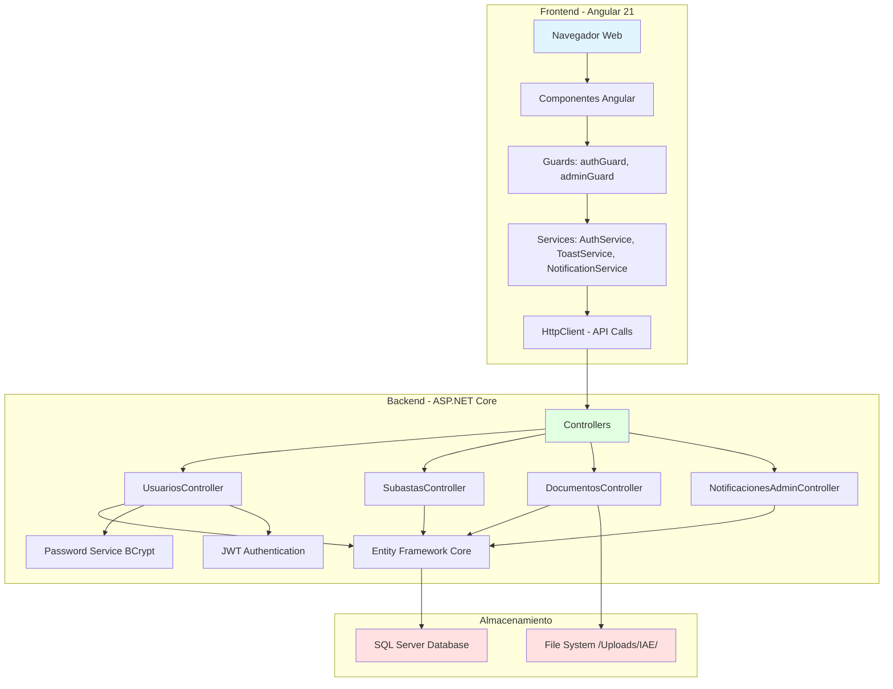

# Diagramas del Sistema de Subastas - Desguaces Borox

## 1. Diagrama Entidad-Relación (Base de Datos)


## 2. Diagrama de Arquitectura del Sistema



## 3. Diagrama de Flujo: Registro y Validación de Usuario

```mermaid
sequenceDiagram
    participant U as Usuario
    participant F as Frontend Angular
    participant API as Backend API
    participant DB as Base de Datos
    participant Admin as Administrador
    
    U->>F: Completa formulario registro
    F->>API: POST /api/Usuarios/registro
    API->>API: Hashear contraseña (BCrypt)
    API->>DB: INSERT Usuario (validado=0)
    API->>DB: INSERT NotificacionAdmin (tipo='registro')
    API->>F: Usuario creado
    F->>U: Registro exitoso
    
    Note over Admin: Polling cada 30s
    Admin->>API: GET /api/NotificacionesAdmin
    API->>DB: SELECT notificaciones WHERE leida=0
    API->>Admin: Lista de notificaciones
    Admin->>Admin: Ve nuevo usuario registrado
    
    U->>F: Sube documento IAE
    F->>API: POST /api/Documentos/subir-iae
    API->>DB: UPDATE Usuario SET documentoIAE
    API->>DB: INSERT NotificacionAdmin (tipo='documento_subido')
    API->>F: Documento guardado
    
    Admin->>API: GET /api/Usuarios
    API->>Admin: Lista usuarios con estado
    Admin->>API: PUT /api/Usuarios/{id}/validar (Validado=true)
    API->>DB: UPDATE Usuario SET validado=1
    API->>Admin: Usuario validado
    
    U->>F: Intenta acceder a subastas
    F->>F: authGuard verifica validado=1
    F->>U: Acceso permitido
```



## 4. Diagrama de Flujo: Creación de Subasta y Puja

```mermaid
flowchart TD
    A[Empresa registra vehículo] --> B{¿Datos válidos?}
    B -->|No| C[Mostrar errores]
    B -->|Sí| D[POST /api/Vehiculos]
    D --> E[Guardar vehículo en BD]
    E --> F[POST /api/Subastas]
    F --> G[Crear subasta con fechas]
    G --> H[Estado: 'activa']
    
    H --> I[Usuario ve subastas activas]
    I --> J{¿Usuario validado?}
    J -->|No| K[Mensaje: debe validarse]
    J -->|Sí| L[Puede realizar puja]
    L --> M[POST /api/Pujas]
    M --> N{¿Monto > precioActual?}
    N -->|No| O[Error: puja insuficiente]
    N -->|Sí| P[Guardar puja]
    P --> Q[UPDATE Subasta precioActual]
    Q --> R[Actualizar vista en tiempo real]
    
    style H fill:#90EE90
    style K fill:#FFB6C1
    style O fill:#FFB6C1
    style R fill:#87CEEB
```



## 5. Diagrama de Flujo: Sistema de Notificaciones Admin

```mermaid
flowchart LR
    subgraph "Eventos que generan notificaciones"
        E1[Usuario se registra]
        E2[Usuario sube IAE]
    end
    
    subgraph "Backend"
        C1[UsuariosController.Registro]
        C2[DocumentosController.SubirIAE]
        DB[(NotificacionAdmin Table)]
    end
    
    subgraph "Frontend Admin"
        P[Polling cada 30s]
        N[Componente Notificaciones]
        L[Lista de notificaciones]
        B[Badge contador no leídas]
    end
    
    E1 --> C1
    E2 --> C2
    C1 --> DB
    C2 --> DB
    
    P --> API[GET /api/NotificacionesAdmin]
    API --> DB
    DB --> N
    N --> L
    N --> B
    
    L --> M[Marcar como leída]
    M --> API2[PUT /api/NotificacionesAdmin/{id}/leer]
    API2 --> DB
    
    style E1 fill:#FFE4B5
    style E2 fill:#FFE4B5
    style DB fill:#FFA07A
    style B fill:#98FB98
```

## 6. Diagrama de Casos de Uso

```mermaid
graph TB
    subgraph "Usuario No Registrado"
        U1((Usuario<br/>Visitante))
        UC1[Registrarse]
        UC2[Ver subastas públicas]
        
        U1 --> UC1
        U1 --> UC2
    end
    
    subgraph "Usuario Registrado No Validado"
        U2((Usuario<br/>Registrado))
        UC3[Subir documento IAE]
        UC4[Ver perfil]
        UC5[Editar perfil]
        
        U2 --> UC3
        U2 --> UC4
        U2 --> UC5
    end
    
    subgraph "Usuario Validado"
        U3((Usuario<br/>Validado))
        UC6[Realizar pujas]
        UC7[Ver mis pujas]
        UC8[Ver historial]
        
        U3 --> UC6
        U3 --> UC7
        U3 --> UC8
    end
    
    subgraph "Empresa"
        U4((Empresa))
        UC9[Registrar vehículos]
        UC10[Crear subastas]
        UC11[Gestionar vehículos]
        
        U4 --> UC9
        U4 --> UC10
        U4 --> UC11
    end
    
    subgraph "Administrador"
        U5((Admin))
        UC12[Validar usuarios]
        UC13[Gestionar usuarios]
        UC14[Ver notificaciones]
        UC15[Descargar documentos IAE]
        UC16[Gestionar pujas]
        UC17[Gestionar empresas]
        
        U5 --> UC12
        U5 --> UC13
        U5 --> UC14
        U5 --> UC15
        U5 --> UC16
        U5 --> UC17
    end
    
    style U1 fill:#E8F4F8
    style U2 fill:#FFF4E6
    style U3 fill:#E8F5E9
    style U4 fill:#F3E5F5
    style U5 fill:#FFEBEE
```



## 7. Diagrama de Estados de Usuario


## 8. Diagrama de Estados de Subasta


## 9. Diagrama de Seguridad y Autenticación

```mermaid
sequenceDiagram
    participant U as Usuario
    participant F as Frontend
    participant Guard as authGuard/adminGuard
    participant API as Backend API
    participant JWT as JWT Service
    participant DB as Database
    
    U->>F: POST /login (email, password)
    F->>API: Credenciales
    API->>DB: SELECT Usuario WHERE email
    DB->>API: Usuario encontrado
    API->>API: BCrypt.Verify(password, hash)
    API->>JWT: Generar token (2h expiración)
    JWT->>API: Token JWT
    API->>F: {token, usuario}
    F->>F: localStorage.setItem('token')
    F->>F: authService.currentUser.set(usuario)
    
    Note over U,DB: Usuario intenta acceder a ruta protegida
    
    F->>Guard: canActivate()
    Guard->>F: authService.currentUser()
    F->>Guard: Usuario actual
    
    alt Es ruta admin
        Guard->>Guard: Verificar rol === 'admin' || 'administrador'
        Guard->>F: Permitir/Denegar acceso
    else Es ruta normal
        Guard->>Guard: Verificar validado === 1
        Guard->>F: Permitir/Denegar acceso
    end
    
    alt Token expirado (>2h)
        F->>U: Redirigir a /login
    end
```



## 10. Diagrama de Componentes Frontend


---

## Leyenda de Colores

- 🔴 **Rojo**: Componentes principales/raíz
- 🟢 **Verde**: Servicios y utilidades
- 🔵 **Azul**: Componentes de usuario
- 🟡 **Amarillo**: Eventos/Triggers
- 🟣 **Morado**: Roles especiales (Admin, Empresa)
- 🟠 **Naranja**: Base de datos

---

## Tecnologías Visualizadas

- **Frontend**: Angular 21 + Signals + Standalone Components
- **Backend**: ASP.NET Core + Entity Framework Core
- **Base de Datos**: SQL Server
- **Autenticación**: JWT (2h expiración) + BCrypt
- **Almacenamiento**: File System para documentos IAE
- **Comunicación**: RESTful API + HttpClient
- **Notificaciones**: Polling cada 30 segundos

---

## Notas de Implementación

1. **Guards**: Los guards verifican tanto el token JWT como el estado del usuario (validado=1 para usuarios, rol=admin/administrador para admins)

2. **Notificaciones**: Sistema de polling que consulta cada 30 segundos. Considera implementar SignalR para notificaciones en tiempo real.

3. **Validación en cascada**: Un usuario debe estar registrado → subir IAE → ser validado por admin → antes de poder pujar.

4. **Seguridad**: Las contraseñas se hashean con BCrypt (salt rounds: 10). Los tokens JWT expiran a las 2 horas.

5. **Estados**: Tanto usuarios como subastas tienen máquinas de estados bien definidas que deben respetarse.
