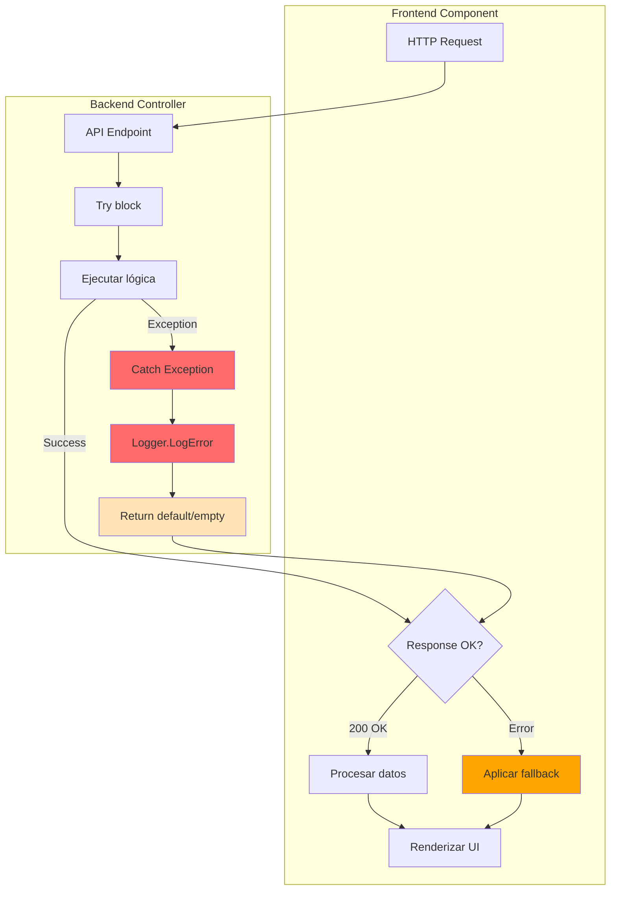
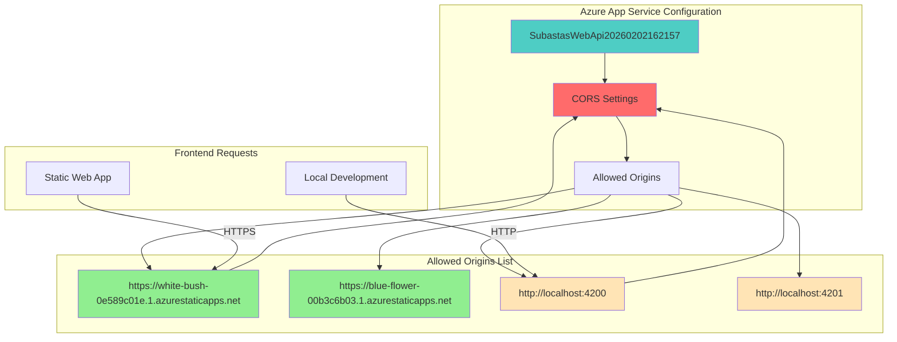

# Nuevas Adiciones a DIAGRAMAS.md

Este archivo documenta nuevos diagramas a agregar al archivo principal.

## 11. Diagrama de Flujo: Actualización de Perfil de Usuario

```mermaid
sequenceDiagram
    participant U as Usuario
    participant F as Frontend
    participant API as Backend API
    participant DB as Database
    
    U->>F: Navega a /perfil
    F->>API: GET /api/Usuarios/{id}
    API->>DB: SELECT Usuario WHERE idUsuario
    DB->>API: Datos usuario
    API->>F: ApiResponse { data: usuario }
    F->>F: Manejar response.data || response
    F->>U: Mostrar formulario con datos
    
    U->>F: Edita datos y guarda
    F->>API: PUT /api/Usuarios/{id}
    Note right of API: Incluye validado, rol, activo
    API->>DB: UPDATE Usuario
    DB->>API: Confirmación
    API->>F: ApiResponse { success: true, data: usuarioActualizado }
    
    F->>API: GET /api/Usuarios/{id}
    Note right of F: Recargar perfil con getApiUrl()
    API->>F: Usuario actualizado
    F->>F: authService.setCurrentUser(usuario)
    F->>F: localStorage.setItem('currentUser')
    F->>U: Perfil actualizado (estado preservado)
    
    style API fill:#4ECDC4
    style DB fill:#FFA07A
```

**Características clave:**
- Usa `getApiUrl()` para construir URLs correctas en Azure
- Maneja wrapper `ApiResponse` con patrón `response.data || response`
- Preserva campos de estado (validado, rol, activo) durante actualización
- Recarga perfil completo después de actualizar para reflejar cambios


## 12. Diagrama de Manejo Defensivo de Errores



**Ejemplos de implementación:**

**Backend (NotificacionesAdminController):**
```csharp
try {
    var notificaciones = await _context.NotificacionesAdmin
        .Include(n => n.Usuario)
        .ToListAsync();
    return Ok(notificaciones);
} catch (Exception ex) {
    _logger.LogError(ex, "Error obteniendo notificaciones");
    return Ok(new List<NotificacionAdmin>());  // Default vacío
}
```

**Frontend (notificaciones-admin.component.ts):**
```typescript
cargarNotificaciones(): void {
  this.http.get<NotificacionAdmin[]>(url).subscribe({
    next: (notificaciones) => {
      this.notificaciones.set(notificaciones || []);  // Fallback
    },
    error: (error) => {
      console.error('Error:', error);
      this.notificaciones.set([]);  // Estado vacío en error
    }
  });
}
```

**Templates (null safety):**
```html
<td>{{ (vehiculo.kilometraje || 0).toLocaleString() }} km</td>
<td>{{ (vehiculo.precioSalida || 0).toLocaleString() }} €</td>
```


## 13. Diagrama de Configuración CORS en Azure



**Configuración mediante Azure CLI:**
```powershell
az webapp cors add --name SubastasWebApi20260202162157 --resource-group Curso --allowed-origins "https://white-bush-0e589c01e.1.azurestaticapps.net"

az webapp cors add --name SubastasWebApi20260202162157 --resource-group Curso --allowed-origins "http://localhost:4200"
```

**Ventajas de CORS a nivel de plataforma:**
- No requiere cambios de código
- Configuración centralizada en Azure Portal
- Evita conflictos con middleware CORS en código
- Permite preflight OPTIONS sin decoradores [Authorize]


## 14. Diagrama de Routing con staticwebapp.config.json

```mermaid
flowchart TB
    subgraph "Azure Static Web App"
        REQUEST[Request: /admin/dashboard]
        SWA_ROUTER[SWA Routing Engine]
        CONFIG[staticwebapp.config.json]
        CHECK{Archivo físico existe?}
        FALLBACK[navigationFallback]
        INDEX[/index.html]
    end
    
    subgraph "Angular App"
        ANGULAR_ROUTER[Angular Router]
        ROUTE_MATCH{Ruta válida?}
        COMPONENT[Cargar componente]
        NOT_FOUND[404 Component]
    end
    
    REQUEST --> SWA_ROUTER
    SWA_ROUTER --> CHECK
    CHECK -->|No| CONFIG
    CONFIG --> FALLBACK
    FALLBACK --> INDEX
    INDEX --> ANGULAR_ROUTER
    
    CHECK -->|Sí - /assets/*| STATIC[Servir archivo estático]
    
    ANGULAR_ROUTER --> ROUTE_MATCH
    ROUTE_MATCH -->|Sí| COMPONENT
    ROUTE_MATCH -->|No| NOT_FOUND
    
    style CONFIG fill:#95E1D3
    style FALLBACK fill:#4ECDC4
    style INDEX fill:#90EE90
    style STATIC fill:#FFE4B5
```

**staticwebapp.config.json:**
```json
{
  "navigationFallback": {
    "rewrite": "/index.html",
    "exclude": [
      "/assets/*",
      "/*.{css,js,json,svg,png,jpg,jpeg,gif,ico,woff,woff2,ttf,eot}"
    ]
  },
  "responseOverrides": {
    "404": {
      "rewrite": "/index.html",
      "statusCode": 200
    }
  }
}
```

**Problema que soluciona:**
- Sin esta configuración: `GET /login` → 404 Not Found
- Con esta configuración: `GET /login` → `/index.html` (200) → Angular Router maneja `/login`


## 15. Diagrama de Login con Redirección Basada en Rol

```mermaid
sequenceDiagram
    participant U as Usuario
    participant F as Frontend
    participant API as Backend
    participant DB as Database
    participant R as Angular Router
    
    U->>F: Ingresa email y password
    F->>API: POST /api/Usuarios/login
    API->>DB: SELECT Usuario WHERE email
    DB->>API: Usuario encontrado
    API->>API: BCrypt.Verify(password, hash)
    API->>API: Generar JWT token (2h)
    API->>F: { token, usuario: { rol, validado, ... } }
    
    F->>F: localStorage.setItem('token', token)
    F->>F: authService.currentUser.set(usuario)
    
    F->>F: Verificar rol del usuario
    
    alt Rol === 'admin' || 'administrador'
        F->>R: router.navigate(['/admin/dashboard'])
        R->>U: Redirige a Dashboard Admin
        Note right of U: Ve estadísticas, gráficos,<br/>gestión de usuarios/vehículos
    else Rol === 'usuario' || validado === 1
        F->>R: router.navigate(['/dashboard'])
        R->>U: Redirige a Dashboard Usuario
        Note right of U: Ve mis pujas activas,<br/>subastas disponibles
    else validado === 0
        F->>R: router.navigate(['/dashboard'])
        Note right of U: Mensaje: "Pendiente de validación"
    end
    
    style API fill:#4ECDC4
    style R fill:#FF6B6B
```

**Código de implementación (login.component.ts):**
```typescript
this.authService.login(email, password).subscribe({
  next: () => {
    this.isLoading.set(false);
    const user = this.authService.currentUser();
    
    // Redirigir según el rol
    if (user?.rol?.toLowerCase() === 'admin') {
      this.router.navigate(['/admin/dashboard']);
    } else {
      this.router.navigate(['/dashboard']);
    }
  }
});
```

**Separación de menús (layout.component.ts):**
```typescript
menuItems: MenuItem[] = [
  { label: 'Dashboard', icon: '🏠', route: '/dashboard', userOnly: true },
  { label: 'Dashboard Admin', icon: '📊', route: '/admin/dashboard', adminOnly: true },
  // ... resto de items
];
```


---

## Resumen de Cambios Documentados

### Infraestructura Azure
- Static Web App para frontend
- App Service para backend
- SQL Server en Azure
- CORS configurado a nivel de plataforma

### Routing y Navegación
- staticwebapp.config.json con navigationFallback
- Redirección basada en rol después del login
- Separación de menús admin/usuario

### Manejo de Errores
- Try-catch en backend retornando defaults
- Fallbacks con || [] y || 0 en frontend
- Logging de errores con ILogger

### Patrones de Código
- ApiResponse wrapper pattern
- getApiUrl() para construcción de URLs
- Null safety en templates con (valor || 0)
- Preservación de estado en actualizaciones

